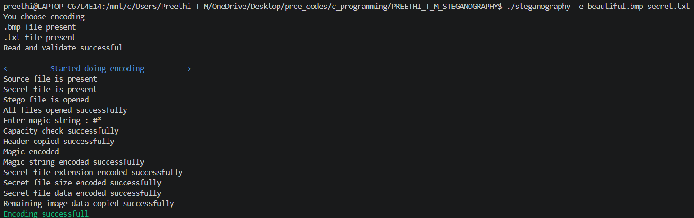
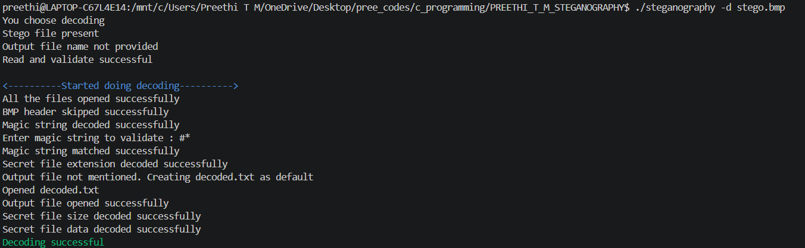
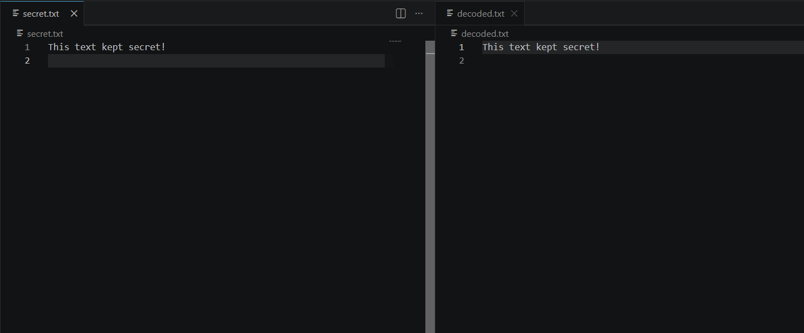

# LSB-Image-Steganography

## 📌 Project Overview

The Steganography project is a C-based application that securely hides secret text inside a BMP image using the Least Significant Bit (LSB) encoding technique. It also supports extracting the hidden message from the encoded image without affecting the visual appearance of the image. The project demonstrates image processing, bit manipulation, and file handling concepts.

## ✨ Features

- Encode secret text into a BMP image
- Decode hidden text from an encoded image
- Uses Least Significant Bit (LSB) encoding
- Preserves the visual quality of the image
- Supports text file as secret data
- Validates input files and image format
- Error handling for invalid inputs
- Modular implementation using multiple source files

## 🛠 Technologies Used

- C Programming
- GCC Compiler
- Makefile
- File Handling
- Bit Manipulation
- BMP Image Processing
- Dynamic Memory Management
- Linux / Git Bash

## 📂 Project Structure

```text
PREETHI_T_M_STEGANOGRAPHY
├── main.c
├── encode.c
├── encode.h
├── decode.c
├── decode.h
├── types.h
├── Makefile
├── README.md
├── beautiful.bmp
├── stego.bmp
├── secret.txt
├── decoded.txt
└── screenshots
    ├── encode.png
    ├── original_vs_encoded
    ├── decode.png
    ├── decoded_message.png
```

## ▶️ How to Compile

```bash
make
```

## ▶️ How to Run

### Encode Secret Data

```bash
./steganography -e <input.bmp> <secret.txt> <output.bmp>
```

### Decode Secret Data

```bash
./steganography -d <output.bmp> <decoded.txt>
```

## 📷 Sample Output

### Encode Operation

The application hides the secret message inside the BMP image.



---

### Encode into Image

The application Encode secret message into another BMP image.


### Decode Operation

The application extracts the hidden message from the encoded image.



---

### Decoded Secret Message

Displays the successfully extracted secret message.



---

## 🎯 Learning Outcomes

- Steganography fundamentals
- Least Significant Bit (LSB) encoding
- Bit manipulation
- BMP image processing
- File handling in C
- Modular programming
- Error handling